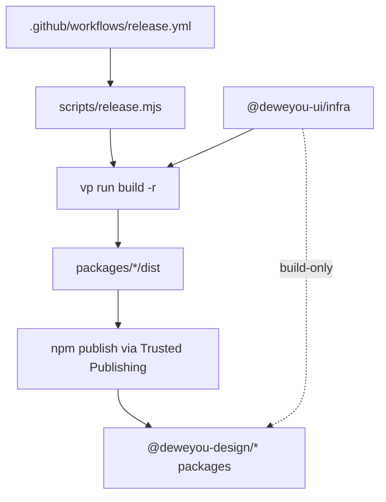

# Package Layers



## Published packages (`@deweyou-design/*`)

These packages are published to npm and consumed externally.

| Package                       | Path                    | Purpose                                               |
| ----------------------------- | ----------------------- | ----------------------------------------------------- |
| `@deweyou-design/react`       | `packages/react/`       | React component library — primary consumer entrypoint |
| `@deweyou-design/react-hooks` | `packages/react-hooks/` | Reusable React hooks, independent of components       |
| `@deweyou-design/react-icons` | `packages/react-icons/` | Curated generated React icon components               |
| `@deweyou-design/styles`      | `packages/styles/`      | Design tokens, theme CSS, Less bridge                 |
| `@deweyou-design/utils`       | `packages/utils/`       | Runtime utilities for external consumers              |
| `@deweyou-design/mcp`         | `packages/mcp/`         | MCP server and AI context for components/styles/icons |

All published packages must:

- Have `publishConfig.directory: "dist"` in `package.json`
- Have a `repository` field pointing at `git+https://github.com/deweyou/design.git`; npm Trusted Publishing validates the package repository against the GitHub Actions publisher.
- Run `write-published-manifest.mjs` in their build script to resolve `workspace:*` and `catalog:` specifiers to concrete version numbers in `dist/package.json`
- Not reference `@deweyou-ui/infra` in runtime `dependencies`

Release CI publishes with npm Trusted Publishing from `.github/workflows/release.yml` through `scripts/release.mjs`. The workflow grants `id-token: write` and does not pass a long-lived npm publish token; `npm whoami` is skipped in GitHub OIDC runs because OIDC authentication is exchanged only during `npm publish`.

## Build-time infrastructure (`@deweyou-ui/infra`)

`packages/infra/` contains build scripts and monorepo tooling used **only during development and CI**. It is not published.

- No `publishConfig` in `package.json`
- No `files` field
- Must never appear in the `dependencies` of a published package
- May appear in `devDependencies` of workspace packages that need its scripts

Key scripts in `packages/infra/scripts/`:

- `write-published-manifest.mjs` — resolves `workspace:*` / `catalog:` in `dist/package.json`

## Dependency rules

```
apps/*            → @deweyou-design/* (workspace:*)
@deweyou-design/react   → @deweyou-design/react-hooks, @deweyou-design/react-icons, @deweyou-design/styles
@deweyou-design/react-hooks → @deweyou-design/utils (optional, runtime)
@deweyou-design/react-icons → (generated icons; tdesign-icons-svg is build-only)
@deweyou-design/styles  → (no deps)
@deweyou-design/utils   → (no deps)
@deweyou-design/mcp     → @modelcontextprotocol/sdk, zod; bundles component/style/icon metadata
@deweyou-ui/infra       → (build-only, never in published deps)
```

Cross-layer violations are caught by `packages/react/tests/workspace-boundaries.test.ts`.

_Last updated: 2026-05-28 | Reason: document Trusted Publishing requirements for release CI and publishable package manifests_
