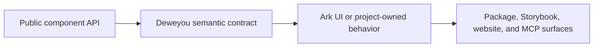

# React Component Contracts



> Audience: AI agents, contributors, and consumers who need the public composition, import, and accessibility contract without reading every source file.

This document is the human-readable companion to `packages/react/package.json` exports. Keep it synchronized with the package export map whenever a component is added, renamed, or removed.

## Import Matrix

| Component               | Root import             | Subpath import                                  |
| ----------------------- | ----------------------- | ----------------------------------------------- |
| `Badge`                 | `@deweyou-design/react` | `@deweyou-design/react/badge`                   |
| `Breadcrumb`            | `@deweyou-design/react` | `@deweyou-design/react/breadcrumb`              |
| `Button`, `IconButton`  | `@deweyou-design/react` | `@deweyou-design/react/button`                  |
| `Card`                  | `@deweyou-design/react` | `@deweyou-design/react/card`                    |
| `Checkbox`              | `@deweyou-design/react` | `@deweyou-design/react/checkbox`                |
| `CodeBlock`             | `@deweyou-design/react` | `@deweyou-design/react/code-block`              |
| `ConfigProvider`        | `@deweyou-design/react` | `@deweyou-design/react/config-provider`         |
| `DatePicker`            | `@deweyou-design/react` | `@deweyou-design/react/date-picker`             |
| `DateRangePicker`       | `@deweyou-design/react` | `@deweyou-design/react/date-range-picker`       |
| `Dialog`                | `@deweyou-design/react` | `@deweyou-design/react/dialog`                  |
| `Field`                 | `@deweyou-design/react` | `@deweyou-design/react/field`                   |
| `GroupedVirtualMasonry` | `@deweyou-design/react` | `@deweyou-design/react/grouped-virtual-masonry` |
| `ImageMasonry`          | `@deweyou-design/react` | `@deweyou-design/react/image-masonry`           |
| `ImagePreview`          | `@deweyou-design/react` | `@deweyou-design/react/image-preview`           |
| `Input`                 | `@deweyou-design/react` | `@deweyou-design/react/input`                   |
| `NumberInput`           | `@deweyou-design/react` | `@deweyou-design/react/number-input`            |
| `MarkdownRender`        | `@deweyou-design/react` | `@deweyou-design/react/markdown-render`         |
| `Editor`                | `@deweyou-design/react` | `@deweyou-design/react/editor`                  |
| `MermaidRender`         | `@deweyou-design/react` | `@deweyou-design/react/mermaid-render`          |
| `Menu`, `ContextMenu`   | `@deweyou-design/react` | `@deweyou-design/react/menu`                    |
| `Nav`                   | `@deweyou-design/react` | `@deweyou-design/react/nav`                     |
| `NavOverlay`            | `@deweyou-design/react` | `@deweyou-design/react/nav-overlay`             |
| `Pagination`            | `@deweyou-design/react` | `@deweyou-design/react/pagination`              |
| `Popover`               | `@deweyou-design/react` | `@deweyou-design/react/popover`                 |
| `RadioGroup`            | `@deweyou-design/react` | `@deweyou-design/react/radio-group`             |
| `ScrollArea`            | `@deweyou-design/react` | `@deweyou-design/react/scroll-area`             |
| `Select`                | `@deweyou-design/react` | `@deweyou-design/react/select`                  |
| `Separator`             | `@deweyou-design/react` | `@deweyou-design/react/separator`               |
| `Skeleton`              | `@deweyou-design/react` | `@deweyou-design/react/skeleton`                |
| `Spinner`               | `@deweyou-design/react` | `@deweyou-design/react/spinner`                 |
| `Switch`                | `@deweyou-design/react` | `@deweyou-design/react/switch`                  |
| `Tabs` family           | `@deweyou-design/react` | `@deweyou-design/react/tabs`                    |
| `Text`                  | `@deweyou-design/react` | `@deweyou-design/react/text`                    |
| `Textarea`              | `@deweyou-design/react` | `@deweyou-design/react/textarea`                |
| `toast`, `Toaster`      | `@deweyou-design/react` | `@deweyou-design/react/toast`                   |
| `Tooltip`               | `@deweyou-design/react` | `@deweyou-design/react/tooltip`                 |
| `VirtualList`           | `@deweyou-design/react` | `@deweyou-design/react/virtual-list`            |
| `VirtualMasonry`        | `@deweyou-design/react` | `@deweyou-design/react/virtual-masonry`         |

Use root imports when a file consumes several components together. Use subpath imports for examples, docs, and single-component usage so bundlers and AI agents can see the intended package boundary.

## Composition Trees

### ConfigProvider and localization

```tsx
import { Suspense } from 'react';
import { ConfigProvider, Pagination } from '@deweyou-design/react';

<Suspense fallback={<span>Loading locale…</span>}>
  <ConfigProvider locale="ja-JP">
    <Pagination count={100} localeText={{ previous: 'Back' }} />
  </ConfigProvider>
</Suspense>;
```

`ConfigProvider` owns the global locale code and is the extension point for future shared
configuration. It accepts `en-US`, `zh-CN`, `zh-TW`, `ja-JP`, and `ko-KR`; a nested provider
inherits an omitted locale and overrides an explicit locale. There is no browser auto-detection.

`en-US` is the synchronous default and fallback. Other dictionaries live in each component or
Editor plugin and load through literal dynamic imports. The caller owns the nearest `Suspense`
boundary for first-time non-English loads. Runtime switches defer replacement so revealed content
stays visible while the next dictionary loads. `localeText` is deliberately absent from
`ConfigProvider`; each copy-owning component or plugin accepts its own typed partial override.

The package does not expose a central dictionary or a preload-all API. This preserves component and
locale chunk boundaries for tree-shaking.

### Button

```tsx
<Button variant="filled" color="primary" size="md">
  Save
</Button>

<IconButton aria-label="Search" icon={<SearchIcon />} variant="outlined" />
```

Icon-only actions must use `IconButton`, `Button.Icon`, or `Button` with the explicit `icon` prop and an accessible name.

Button shape stays orthogonal to variant, mode, and size: `rect` is 0, `auto`/`float` is 8px, and `pill` is 999px. Filled, outlined, ghost, and IconButton modes share the same float radius. Visible surfaces follow the 24/32/40/48/56px control-height ladder with 16/20/24/28/32px icons; coarse pointers expand the target to at least 44px without inflating fine-pointer layout. See the [Button visual density design](../superpowers/specs/2026-07-22-button-visual-density-design.md) and the [component density contract](../superpowers/specs/2026-07-22-component-density-contract.md).

### Field

```tsx
<Field.Root id="email" required hasDescription>
  <Field.Label>Email</Field.Label>
  <Field.Control>
    <input />
  </Field.Control>
  <Field.Description>Use a work email.</Field.Description>
</Field.Root>
```

`Field` owns the label/control/description/error id wiring. `Input`, `DatePicker`, `NumberInput`, `Textarea`, and `Select` use it internally.

### NumberInput

```tsx
<NumberInput
  defaultValue="2"
  label="Quantity"
  hint="Choose from 1 to 10."
  min={1}
  max={10}
  step={1}
/>

<NumberInput
  defaultValue="1280"
  label="Budget"
  locale="zh-CN"
  formatOptions={{ style: 'currency', currency: 'CNY' }}
/>
```

`NumberInput` combines direct text editing with decrement/increment controls. Ark UI owns parsing, keyboard stepping, press-and-hold, clamping, and spinbutton semantics. `precision` supplies default fraction-digit bounds while explicit `formatOptions` values take precedence.

### DatePicker

```tsx
const firstDay = parseDatePickerValue('2026-01-01');
const lastDay = parseDatePickerValue('2026-12-31');

<DatePicker
  clearable
  defaultValue={parseDatePickerValue('2026-07-22')}
  format={(value) =>
    `${String(value.day).padStart(2, '0')}/${String(value.month).padStart(2, '0')}/${value.year}`
  }
  label="Published"
  min={firstDay}
  max={lastDay}
  parse={(input) => {
    const [day, month, year] = input.split('/').map(Number);
    return year && month && day ? new CalendarDate(year, month, day) : undefined;
  }}
  showToday
/>;

<DatePicker defaultValue={parseDatePickerValue('2026-07-01')} label="Billing month" mode="month" />;

<DatePicker defaultValue={parseDatePickerValue('2026-01-01')} label="Reporting year" mode="year" />;

<DatePicker
  defaultValue={parseDatePickerDateTimeValue('2026-07-22T14:30')}
  label="Published at"
  showTime={{ hourCycle: 24, minuteStep: 5, showNow: true }}
/>;
```

`DatePicker` uses `CalendarDate` for `value`, `defaultValue`, `min`, `max`, and `onValueChange`. Its default text display is always `YYYY/MM/DD`; direct input also accepts `YYYY-MM-DD` and `YYYY MM DD`, then normalizes the committed display to slashes. `parseDatePickerValue` is the package-owned parsing boundary for canonical `YYYY-MM-DD` strings. The public value remains a calendar date with no time or time zone.

`mode="date" | "month" | "year"` controls the minimum selectable calendar unit and defaults to `date`. Date mode keeps the day -> month -> year navigation hierarchy. Month mode starts on the month grid, may open the year grid for navigation, displays and accepts `YYYY/MM`, `YYYY-MM`, or `YYYY MM`, and emits the selected month as its first day. Year mode stays on the year grid, displays and accepts `YYYY`, and emits January 1 of the selected year. Incoming values, `min`, `max`, parsed text, Today, unavailable-date checks, and emitted values are normalized to the selected unit so one `CalendarDate` contract remains deterministic across modes.

Provide `format` and `parse` together when an application needs a non-default text representation. Both callbacks receive the semantic `CalendarDate` contract and the current ConfigProvider locale; parsing returns `undefined` for incomplete or invalid text. Calendar month names, weekday labels, first day of week, month/year title order, and component-owned copy inherit the nearest `ConfigProvider` locale, while the default input order stays year-first. DatePicker has no instance `locale`, `startOfWeek`, or `fixedWeeks` prop. Use the exported `DatePickerLocaleTextOverrides` type when `localeText` needs to override component-owned action copy.

`size="sm" | "md" | "lg"` is one density contract for the whole picker: it scales the field and the portalled calendar panel together. Coarse-pointer environments retain the shared minimum touch target even when the visual size is small.

Set `showToday` to display the localized Today action; it is hidden by default. The action selects the local calendar day, month, or year according to `mode` and closes DatePicker, and is disabled when that normalized value is outside `min`, `max`, or `isDateUnavailable`. The field itself opens the popup. Its trailing calendar icon is decorative and changes into the clear action on hover or focus when a value can be cleared.

Set `showTime` to `true` or a `DatePickerTimeOptions` object to select a
`CalendarDateTime` instead. The value represents a calendar date plus
wall-clock time without an implicit time zone; convert it to a zoned instant
only at the application boundary where the intended time zone is known.
`parseDatePickerDateTimeValue` accepts canonical `YYYY-MM-DDTHH:mm` and
`YYYY-MM-DDTHH:mm:ss` strings.

The time-enabled panel keeps calendar and wheel edits as a draft. The user may
switch between the calendar and scroll-wheel time view without committing;
only the localized Confirm action emits the value, while Escape or outside
dismissal restores the committed value. The options object configures the
locale-derived or explicit 12/24-hour cycle, minute or second precision,
per-column steps, the first selected date's `defaultTime`, and
`isTimeUnavailable`. Set `showNow` inside that object to expose a localized Now
action only in the time view. It applies the nearest stepped local wall-clock
time to the existing draft date, remains subject to date-time constraints, and
still waits for Confirm. `showTime` is available only in the default date mode.
When `showToday` is also enabled, Today changes the draft date, preserves its
time, and still waits for confirmation.

### DateRangePicker

```tsx
<DateRangePicker
  clearable
  defaultValue={{
    start: parseDatePickerValue('2026-07-22'),
    end: parseDatePickerValue('2026-07-25'),
  }}
  label="Publishing period"
/>;

<DateRangePicker
  defaultValue={{
    start: parseDatePickerValue('2026-07-01'),
    end: parseDatePickerValue('2026-10-01'),
  }}
  label="Billing period"
  mode="month"
/>;

<DateRangePicker
  defaultValue={{
    start: parseDatePickerDateTimeValue('2026-07-22T09:00'),
    end: parseDatePickerDateTimeValue('2026-07-25T18:00'),
  }}
  label="Booking period"
  showTime={{ hourCycle: 24, minuteStep: 15, showNow: true }}
/>;
```

`DateRangePicker` selects one contiguous inclusive range and intentionally does
not model multiple disjoint ranges. The public value is an object with named
`start` and `end` members. It uses `CalendarDate` by default and
`CalendarDateTime` when `showTime` is enabled. Both values must use the same
semantic type and the start must not be after the end.

The field contains two real inputs for form and accessibility semantics, but
renders them inside one shared visual control with one separator and one
contextual clear action. Endpoint labels, actions, calendar copy, week layout,
and formatting locale inherit `ConfigProvider`; there is no per-instance
`locale` prop.

Date, month, and year modes mirror `DatePicker`. Month and year selections are
normalized to the first day of their unit. `format` and `parse` apply to both
endpoint inputs, while `min`, `max`, `isDateUnavailable`, `showToday`, `size`,
`variant`, controlled state, portal placement, and field states keep the same
meaning as the single-value picker.

With `showTime`, each endpoint has an independent time-wheel entry point.
Calendar and wheel changes remain a draft until Confirm. `defaultTime` accepts
named `start` and `end` times, and `showNow` applies only to the active endpoint.
Choices that would make the start later than the end are unavailable. As with
`DatePicker`, values are wall-clock calendar values without an implicit time
zone.

### Dialog

```text
Dialog
├── Dialog.Root
├── Dialog.Trigger
├── Dialog.Content
│   ├── Dialog.Title
│   ├── Dialog.Description
│   └── Dialog.CloseTrigger
```

```tsx
<Dialog.Root>
  <Dialog.Trigger>
    <Button>Open</Button>
  </Dialog.Trigger>
  <Dialog.Content>
    <Dialog.Title>Confirm action</Dialog.Title>
    <Dialog.Description>This action can be reviewed before saving.</Dialog.Description>
    <Dialog.CloseTrigger>
      <Button variant="outlined">Close</Button>
    </Dialog.CloseTrigger>
  </Dialog.Content>
</Dialog.Root>
```

### Menu

```text
Menu
├── Menu
├── MenuTrigger
└── MenuContent
    ├── MenuItem
    ├── MenuGroup
    │   └── MenuGroupLabel
    ├── MenuSeparator
    ├── MenuTriggerItem
    ├── MenuRadioGroup
    │   └── MenuRadioItem
    └── MenuCheckboxItem
```

Use `ContextMenu` for right-click surfaces. Use `MenuTrigger asChild` when the trigger should be an existing button. `Menu` maps `sm`, `md`, and `lg` to 32px, 40px, and 48px visible rows; coarse pointers retain a 44px minimum target.

### Select

```text
Select
├── Select.Root
├── Select.Trigger
└── Select.Content
    └── Select.Item
```

```tsx
<Select.Root id="fruit" label="Fruit" hint="Pick one fruit." placeholder="Pick a fruit">
  <Select.Trigger />
  <Select.Content>
    <Select.Item value="apple" label="Apple" />
    <Select.Item value="banana" label="Banana" />
  </Select.Content>
</Select.Root>
```

`Select.Root` accepts `label`, `hint`, `error`, `required`, `disabled`, and `size`; `Select.Trigger` receives the field aria contract. `sm`, `md`, and `lg` map to 32px, 40px, and 48px visible trigger and option rows, with `md` as the default.

### Tabs

```text
Tabs
├── Tabs
├── TabList
│   ├── TabTrigger
│   └── TabIndicator
└── TabContent
```

`Tabs` can be controlled with `value` / `onValueChange` or uncontrolled with `defaultValue`.
Its `sm`, `md`, and `lg` triggers follow the same 32px, 40px, and 48px visible density ladder.
Use `hideContent` for route-backed tab bars where panels are owned by the router. In that pattern,
keep `Tabs` controlled by the current route and handle visible-tab navigation through `TabTrigger`
`onClick`. When `overflowMode="collapse"` is used, mirror the same action in `onSelect` so selecting
an item from the overflow menu follows the same route or command.

```tsx
<Tabs activationMode="manual" hideContent overflowMode="collapse" value={pathname}>
  <TabList>
    <TabTrigger
      value="/components"
      onClick={() => navigate('/components')}
      onSelect={() => navigate('/components')}
    >
      Components
    </TabTrigger>
  </TabList>
</Tabs>
```

### MarkdownRender

```tsx
<MarkdownRender value={content} size="md" />

<MarkdownRender
  value={content}
  onLinkClick={({ href, index, text }) => {
    trackLinkClick({ href, index, text })
  }}
  onCopy={({ text }) => {
    trackCopy(text)
  }}
/>

<MarkdownRender
  value={content}
  resolveNodeAttributes={({ index, node, text }) =>
    node.startsWith('h') ? { id: `${node}-${slugify(text)}-${index}` } : undefined
  }
/>

<MarkdownRender value={content} components={{ a: CustomLink, pre: CodeBlock }} />
```

`MarkdownRender` is the safe runtime Markdown path for CommonMark plus GFM content. Use `size` to adjust typography density, `onLinkClick` and `onCopy` for light interaction hooks, `resolveNodeAttributes` to attach light DOM attributes such as heading ids, `components` to replace rendered nodes, and `className` with `[data-markdown-node]` selectors for light style overrides. Event callbacks preserve default browser behavior unless the consumer calls `event.preventDefault()`. `resolveNodeAttributes` receives the node name, text content, and a zero-based per-node `index`, which keeps repeated headings addressable without a component override. Fenced code blocks render through `CodeBlock`, with syntax highlighting from Markdown parsing and a compact language tag when a language is present. Tables and code blocks use default max-height guards with scrolling; override `--markdown-table-max-height` or `--markdown-code-max-height` from the consumer surface when needed. MDX and executable content belong in a separate rendering boundary.

### Editor

```tsx
<Editor
  adapter={markdownEditorAdapter()}
  plugins={[
    historyPlugin(),
    textFormatPlugin(),
    headingPlugin(),
    listPlugin(),
    toolbarPlugin(),
    markdownShortcutPlugin(),
    keyboardShortcutPlugin(),
  ]}
/>
```

`Editor` is the editor capability surface for Deweyou Design. Keep content
formats behind adapters; do not add a `format` prop to the component. Use
`markdownEditorAdapter()` for Markdown strings. Prefer focused feature plugins
for text, heading, list, quote, link, code, and table behavior; entrypoint plugins
such as `toolbarPlugin()`, `floatingToolbarPlugin()`, `blockToolbarPlugin()`,
`markdownShortcutPlugin()`, `keyboardShortcutPlugin()`, and `pastePlugin()` should
consume feature contributions from the registry instead of hardcoding feature
logic. `richTextPlugin()` remains a compatibility preset.

Editor subpath exports:

- `@deweyou-design/react/editor`
- `@deweyou-design/react/editor/core`
- `@deweyou-design/react/editor/adapters/markdown`
- `@deweyou-design/react/editor/plugins/block-toolbar`
- `@deweyou-design/react/editor/plugins/code`
- `@deweyou-design/react/editor/plugins/floating-toolbar`
- `@deweyou-design/react/editor/plugins/heading`
- `@deweyou-design/react/editor/plugins/history`
- `@deweyou-design/react/editor/plugins/keyboard-shortcut`
- `@deweyou-design/react/editor/plugins/link`
- `@deweyou-design/react/editor/plugins/list`
- `@deweyou-design/react/editor/plugins/markdown-shortcut`
- `@deweyou-design/react/editor/plugins/paste`
- `@deweyou-design/react/editor/plugins/quote`
- `@deweyou-design/react/editor/plugins/rich-text`
- `@deweyou-design/react/editor/plugins/table`
- `@deweyou-design/react/editor/plugins/text-format`
- `@deweyou-design/react/editor/plugins/toolbar`
- `@deweyou-design/react/editor/utils`

### MermaidRender

```tsx
<MermaidRender value={diagram} />
<MindmapRender value={mindmapDiagram} />
```

`MermaidRender` is the read-only diagram renderer for Mermaid strings. It prefers `beautiful-mermaid` for supported diagram families, uses Deweyou SVG rendering for `mindmap`, and falls back to native Mermaid for other syntax. Use it from Markdown by overriding fenced code blocks through `MarkdownRender` `components`; Mermaid execution remains outside the default Markdown path.

### CodeBlock

```tsx
<CodeBlock copy language="tsx">{`const value = "Deweyou"`}</CodeBlock>
<CodeBlock size="sm">npm i @deweyou-design/react</CodeBlock>
```

`CodeBlock` is the shared scrollable block-code primitive. Use it for standalone snippets in product surfaces and documentation so they visually match fenced code rendered by `MarkdownRender`. Pass `language` when the label adds useful context; it supports common ids such as `ts`, `tsx`, `js`, `jsx`, `json`, `css`, `html`, `bash`, and `markdown`, while still accepting custom strings. Set `copy` to show the compact copy icon button; `onCopy` receives the copied plain text after the Clipboard API write succeeds.

Use `CodeBlockToolbar`, `CodeBlockActionButton`, `CodeBlockLanguageButton`, and
`CodeBlockLanguageLabel` when another surface owns the code DOM but needs the
same code-block chrome. This keeps editable code blocks and display code blocks
visually aligned without forcing consumers to adopt `CodeBlock`'s read-only
`pre/code` structure.

### Navigation

```text
Nav
├── Nav.Root
├── Nav.Link
└── Nav.Responsive

NavOverlay
├── NavOverlay.Root
├── NavOverlay.Trigger
├── NavOverlay.Content
└── NavOverlay.CloseButton
```

Use `Nav` for visible navigation landmarks. Use `NavOverlay` for responsive fullscreen navigation.
Use `Nav.Responsive` when the same navigation destinations should render inline on wide screens and collapse into a fullscreen overlay on small screens. Keep route or section destinations inside `Nav.Responsive`; keep global actions such as theme toggles, GitHub links, and account controls outside the nav as adjacent `IconButton` actions. Do not use `Tabs` for this pattern unless the component also owns tab panels and tab activation semantics.
`Nav` uses 32px, 40px, and 48px visible links for `sm`, `md`, and `lg`. `Pagination` exposes the same three-size ladder and defaults to `md`.

### Virtualized Content

```tsx
const listRef = useRef<VirtualListRef>(null);

<VirtualList
  ref={listRef}
  count={articles.length}
  height={420}
  estimateSize={() => 72}
  scrollMargin={64}
  onRangeChange={(range) => syncReadingProgress(range.startIndex)}
  renderItem={({ index, measureRef }) => (
    <article ref={measureRef} id={articles[index].id}>
      <ArticleAnchorRow article={articles[index]} />
    </article>
  )}
/>;
```

`VirtualList` renders a scrollable window over large one-dimensional content and uses `ScrollArea` internally so scrollbar styling stays aligned with the rest of the system. It measures rendered items with `ResizeObserver`, so long MDX feeds can start from `estimateSize(index)` and then settle into real heights as text wraps, images load, and responsive layout changes. Use `scrollElement="window"` when the page itself owns scrolling, `scrollMargin` or `scrollToIndex(index, { offset })` for sticky navigation, and `onRangeChange` for URL hash or reading progress sync. The default wrapper keeps `role="listitem"` plus positional ARIA; pass `itemRole={null}` when the rendered article should own item semantics.

### Image Collections

```tsx
<ImageMasonry
  images={photos}
  minColumnWidth={220}
  maxColumnCount={4}
  onItemClick={({ index }) => openPreview(index)}
/>

<ImagePreview
  images={photos}
  open={previewOpen}
  currentIndex={previewIndex}
  onOpenChange={setPreviewOpen}
  onIndexChange={({ index }) => setPreviewIndex(index)}
/>
```

`ImagePreview` is the modal image-viewer surface for one image or a small gallery. It uses `Dialog` for focus and Escape behavior, exposes controlled and uncontrolled open/index state, and keeps zoom controls in an icon toolbar. Use it with `ImageMasonry` by opening the preview from `onItemClick`.

`ImageMasonry` lays out fixed-column or responsive image grids with shortest-column placement. Responsive mode reads the container width with `ResizeObserver`, `minColumnWidth`, and optional `maxColumnCount`; fixed mode uses `columnCount`. Pass `aspectRatio` or positive `width` and `height` on each image so the masonry can reserve stable geometry before images load. Each item keeps list/listitem semantics by default, and custom renderers receive the computed layout item.

```tsx
const masonryRef = useRef<VirtualMasonryRef>(null);

<VirtualMasonry
  ref={masonryRef}
  images={photos}
  height={480}
  minColumnWidth={220}
  overscan={360}
  onRangeChange={(range) => preloadAround(range.endIndex)}
/>;
```

`VirtualMasonry` shares the same masonry layout contract but only mounts the visible image cards plus a pixel overscan window. Use it for long or unbounded image collections where mounting every image would create scroll and decoding pressure. It requires the same stable image geometry contract as `ImageMasonry`: provide `aspectRatio` or positive `width` and `height`, especially for long virtualized feeds where unmounted images cannot be measured from rendered DOM. Its ref mirrors the list virtualization contract with `scrollToIndex`, `scrollToOffset`, and `getScrollOffset`.

```tsx
const groupedMasonryRef = useRef<GroupedVirtualMasonryRef>(null);

<GroupedVirtualMasonry
  ref={groupedMasonryRef}
  groups={[
    { id: 'today', title: 'Today', images: todayPhotos },
    { id: 'archive', title: 'Archive', images: archivePhotos },
  ]}
  groupHeaderHeight={44}
  height={480}
  minColumnWidth={220}
  overscan={360}
/>;
```

For small grouped galleries, compose multiple `ImageMasonry` instances and keep section headings in the consuming layout. Use `GroupedVirtualMasonry` when the grouped image feed itself needs virtualization; it keeps group headers and masonry cells in one scroll-height model, requires a fixed `groupHeaderHeight`, and exposes `scrollToGroup`, `scrollToItem`, `scrollToOffset`, and `getScrollOffset` through its ref. Group `title` accepts any `ReactNode`, and `renderGroupHeader` is the richer path for custom title layouts, counts, actions, or typography.

### Floating And Feedback

```text
Popover
├── Popover
└── content prop

Tooltip
├── Tooltip.Root
├── Tooltip.Trigger
└── Tooltip.Content

Toast
├── Toaster
└── toast.create(options)
```

`Popover`, `Tooltip`, `Dialog`, `DatePicker`, `Menu`, `Select`, and `Toast` rely on Ark UI for behavior and must keep focus, keyboard, and portal behavior delegated to Ark primitives.

## Accessibility Contracts

| Component                          | Contract                                                                                                                                                                                                                          |
| ---------------------------------- | --------------------------------------------------------------------------------------------------------------------------------------------------------------------------------------------------------------------------------- |
| `Button`                           | Text buttons render visible content. Icon-only buttons require `aria-label` or `aria-labelledby`. Loading buttons set `aria-busy` and block repeated activation.                                                                  |
| `ConfigProvider`                   | Defaults to `en-US`; non-English descendants suspend only for their own uncached locale chunks, and application-owned boundaries provide loading UI.                                                                              |
| `Field`                            | `Field.Label` points at the control id. `Field.Description` and `Field.ErrorText` provide `aria-describedby`; errors set `role="alert"` and take precedence over hints.                                                           |
| `Input`, `Textarea`                | Label, hint, error, `required`, `disabled`, and invalid state are wired through `Field`.                                                                                                                                          |
| `DatePicker`, `DateRangePicker`    | Ark UI owns calendar grid, range hover, listbox wheel, roving focus, constraints, selection, and popup dismissal semantics; Deweyou owns the year-first text, unified range field, and explicit date-time confirmation contracts. |
| `NumberInput`                      | Ark UI owns spinbutton semantics, keyboard and press stepping, boundary-disabled triggers, parsing, and clamping; `Field` owns label, hint, and error relationships.                                                              |
| `Checkbox`, `RadioGroup`, `Switch` | Ark UI owns native hidden inputs, checked state, disabled state, and keyboard behavior.                                                                                                                                           |
| `Select`                           | Trigger uses `role="combobox"`, listbox/options come from Ark UI, and field copy is exposed through label and description ids.                                                                                                    |
| `Dialog`, `NavOverlay`             | Modal focus management and Escape handling come from Ark UI. Content is SSR-safe and portals to `document.body` only in the browser.                                                                                              |
| `Menu`, `ContextMenu`              | Menu roles, item selection, nested triggers, and keyboard navigation come from Ark UI.                                                                                                                                            |
| `Tabs`                             | Tablist, tab, panel, selected state, and keyboard activation come from Ark UI plus local overflow handling.                                                                                                                       |
| `Tooltip`, `Popover`               | Floating content must remain non-destructive and dismissible; focus/hover/click behavior is explicit through props.                                                                                                               |
| `Toast`                            | `Toaster` should be mounted once per position; notifications are created with `toast.create`.                                                                                                                                     |

## Component Notes

- `Badge`, `Card`, `Separator`, `Skeleton`, `Spinner`, and `Text` are presentational primitives. They should stay token-driven and avoid hidden behavior.
- `MarkdownRender` is a content rendering primitive for CommonMark plus GFM strings. Keep it text-to-React and separate from MDX or executable content.
- `Pagination`, `Breadcrumb`, `Nav`, and `Tabs` are navigation primitives. They should expose semantic markup first and visual variants second.
- `ScrollArea` is a layout primitive. Keep viewport/scrollbar/thumb composition explicit.
- Public component props should stay decoupled from Ark UI prop names unless the Ark term is already the common component vocabulary.
- New public components must include source, CSS module, colocated unit tests, Storybook `Interaction`, README entry, this component contract entry, root and subpath exports, and package/docs contract coverage.
- New component designs with non-obvious trade-offs or future extension paths must be recorded in `docs/superpowers/specs/` and `docs/superpowers/plans/` before implementation continues.

_Last updated: 2026-07-24 | Reason: document DateRangePicker range and endpoint time contracts_
