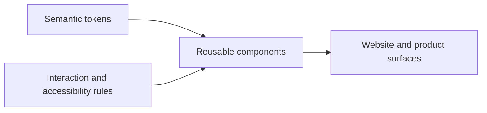

# Deweyou Design System Knowledge



> Audience: AI-assisted development, component implementation, website/mobile UI design review
> Sources: existing repository components and Claude Design handoff for Deweyou Design System
> Goal: preserve design intent and judgment rules that are not easy to infer from code, instead of restating every component implementation.

---

## Design Philosophy

Deweyou Design is Dewey Ou's personal design system. It serves the blog, component preview site, and small tool applications. It does not chase a generic SaaS style; it aims for a restrained, clear, personal product language with memorable typography.

The core judgment phrase is: **Simple, clean, and with clean lines. Less is more.**

In interface work, this becomes five principles:

- **Sans carries controls; serif carries content**: default UI, navigation, forms, buttons, tooltips, and controls use the Source Han Sans direction. Markdown, `Text`, long-form content, and display headings keep the Source Han Serif direction as the brand typographic memory.
- **Semantics over decoration**: the system recognizes only three regular component semantic colors: neutral, primary, and danger. Color expresses role, not excitement.
- **Neutral canvases carry content**: page backgrounds use neutral light-gray and white layers. Do not use cream or beige as the default canvas. Dark themes should feel like ink on paper, not a high-contrast glowing interface.
- **Borders before shadows**: cards, containers, and forms establish structure with 1px borders first. Shadows express floating-surface elevation only; they do not group ordinary content.
- **Typographic precision over illustration**: do not use gradient backgrounds, hero images, emoji, glassmorphism, or large decorative illustrations to create atmosphere. Recognition comes from serif typography, whitespace, lines, radius, and a small amount of green.

These principles take precedence over temporary page aesthetics. If a requirement appears to need more colors, more decoration, or more dramatic motion, first check whether it has drifted away from Deweyou's personal design language.

---

## Content And Voice

User-facing product copy may use the product's target locale, including Simplified Chinese where appropriate. Repository knowledge and durable design docs are written in English.

The voice should be factual, technical, and restrained:

- Use short sentences and clear nouns. Avoid marketing promises.
- Use imperative wording for actions, such as `Open menu`, `Copy`, and `Delete`.
- Use fewer pronouns. Avoid ad-style phrasing.
- Do not use emoji.
- Do not manually insert spaces between Chinese and English in Chinese product copy; the serif rhythm handles visual balance.
- `·` is the system signature separator. Use it for eyebrows, section labels, and parallel version/category metadata.

Example:

```text
Component Library · v1.0
Built on serif rhythm and a warm palette, with 27 components for complete UI scenarios. Light and dark themes, ready out of the box.
Design & Components
Icons · Deweyou registry
View all icons →
```

English eyebrows or micro labels can use uppercase plus letter spacing, but only for small supporting hierarchy. Control copy defaults to sans; body content and display headings use serif.

---

## Tokens Are The Source Of Truth

Component code may consume only `--ui-*` semantic tokens. Palette primitives, concrete hex/hsl/rgba values, and temporary opacity values should not appear in component styles.

Correct:

```less
.root {
  color: var(--ui-color-text);
  background: var(--ui-color-surface);
  border: 1px solid var(--ui-color-border);
}

.root:hover {
  background: color-mix(in srgb, var(--ui-color-text) 8%, transparent);
}
```

Incorrect:

```less
.root {
  background: #ffffff;
  border-color: var(--color-stone-200);
}

.root:hover {
  background: rgba(28, 25, 23, 0.08);
}
```

Before adding a new visual value, ask three questions:

1. Is this a reusable design-system primitive, or a one-off layout need for a page?
2. Can it be derived from existing semantic tokens plus `color-mix()`?
3. Would it introduce a fourth semantic role or a fifth radius/shadow level?

If the answers show that it expands the system language, update design documentation and tokens before implementing the component.

---

## Color System

### Semantic Roles

| Role    | Visual source | Usage                                                            |
| ------- | ------------- | ---------------------------------------------------------------- |
| neutral | stone         | default text, borders, surfaces, neutral actions                 |
| primary | emerald       | brand emphasis, primary actions, selected, compact-control focus |
| danger  | red           | destructive actions and error states                             |

`warning` may exist as a supporting feedback role in components such as Toast, but do not expand it into a general component color. Regular components such as Badge, Button, Tabs, Menu, and form controls should expose only the three semantic colors.

### Brand Green

The UI primary color is deep emerald, not the bright mint gradient from the logo. The logo gradient belongs only to the wordmark; do not use it for buttons, backgrounds, cards, or floating-surface decoration.

Compact controls follow the same restrained direction. `--ui-color-focus-ring` resolves to `emerald-800` in the light theme and `emerald-700` in the dark theme. Do not use the brighter mint steps for focus feedback. Application chrome and large clickable content surfaces use neutral focus feedback so brand color does not become a decorative frame.

### Canvas And Surfaces

Light theme uses neutral light-gray canvas and white surfaces, with surface and raised surface stepping upward. Do not use cream, beige, or large gradients as page atmosphere.

Dark theme should stay warm black with low glare. Text should not glow pure white; it should feel like warm off-white ink on paper.

---

## Typography

Font stack:

```css
--ui-font-sans:
  'Source Han Sans SC Web', 'PingFang SC', 'Heiti SC', 'Microsoft YaHei', 'Noto Sans CJK SC',
  sans-serif;
--ui-font-serif: 'Source Han Serif CN Web', 'Songti SC', 'STSong', 'SimSun', 'NSimSun', serif;
--ui-font-body: var(--ui-font-sans);
--ui-font-control: var(--ui-font-sans);
--ui-font-content: var(--ui-font-serif);
--ui-font-display: 'Source Han Serif CN Web', 'Songti SC', 'STSong', 'SimSun', serif;
--ui-font-mono: 'IBM Plex Mono', 'SFMono-Regular', ui-monospace, monospace;
```

Rules:

- Body/control uses sans for component readability and control density.
- Content/display uses serif for `MarkdownRender`, `Text`, long-form content, and display headings.
- Use only four weights: 400, 500, 600, and 700.
- Display line height is tight; body line height is more relaxed.
- Do not mix heading sizes at the same page hierarchy level. Do not use hero-scale type inside compact components.
- Use mono for technical tokens, code snippets, and package names, but do not switch ordinary English UI copy to mono.
- Use the `<Text>` component for typographic semantics instead of writing raw h1-h5/p elements inside components and patching styles afterward.

Font assets:

- `theme-with-fonts.css` declares both `Source Han Sans SC Web` and `Source Han Serif CN Web`.
- `theme.css` declares tokens only and does not force font file loading. Production sites should explicitly load fonts through the font subset plugin or their own font strategy.
- Official Source Han Sans SC static weights do not include 600. The system maps the 600 semantic weight to the Medium file to avoid browser-synthesized overweight glyphs.
- `fontSubset.vite({ inject: true })` can automatically inject subset CSS in Vite SPAs. Libraries, SSR, and multi-entry apps should keep explicit imports.
- `fullFonts: 'idle'` is an optional fallback strategy. The first screen still uses subsets; after the page becomes idle, the FontFace API registers full fonts. Full-font filenames use the font release version instead of a build hash, such as `source-han-serif-cn-full-400-v2.003R.otf`, so browsers can cache them long term.

Type scale baseline:

| Level   | Font size                  | Line height | Weight |
| ------- | -------------------------- | ----------- | ------ |
| h1      | clamp(2.8rem, 5vw, 4.6rem) | 1.02        | 700    |
| h2      | 2.3rem                     | 1.08        | 600    |
| h3      | 1.85rem                    | 1.14        | 600    |
| h4      | 1.45rem                    | 1.22        | 600    |
| h5      | 1.15rem                    | 1.32        | 700    |
| body    | 1rem                       | 1.6         | 400    |
| caption | 0.875rem                   | 1.45        | 400    |

---

## Space, Size, And Shape

Spacing uses a 4px grid:

| Token | Value |
| ----- | ----- |
| xs    | 4px   |
| sm    | 8px   |
| md    | 16px  |
| lg    | 24px  |
| xl    | 40px  |

Interactive components have five sizes:

| Size | Height | Usage                                           |
| ---- | ------ | ----------------------------------------------- |
| xs   | 24px   | compact table actions and inline helper buttons |
| sm   | 32px   | toolbars, sidebars, secondary form actions      |
| md   | 40px   | default size                                    |
| lg   | 48px   | page primary actions and key forms              |
| xl   | 56px   | hero or landing-page CTA                        |

There are only four radius levels:

| Level | Value | Judgment rule                                    |
| ----- | ----- | ------------------------------------------------ |
| rect  | 0     | inputs, textareas, embedded form elements        |
| float | 4px   | ghost/link buttons, tooltips, small light floats |
| auto  | 8px   | filled/outlined buttons, cards, dialogs, menus   |
| pill  | 999px | badges, switches, pill actions                   |

Do not write intermediate radii such as `6px`, `10px`, or `12px`. If the visual feels wrong, the component is usually classified incorrectly; it usually does not need a new radius.

---

## Component Variant Model

Public components prefer four orthogonal dimensions:

| Dimension | Question                      | Values                                   |
| --------- | ----------------------------- | ---------------------------------------- |
| variant   | What is the visual hierarchy? | `filled` / `outlined` / `ghost` / `link` |
| color     | What is the semantic intent?  | `neutral` / `primary` / `danger`         |
| size      | How much space does it take?  | `xs` / `sm` / `md` / `lg` / `xl`         |
| shape     | What is the corner shape?     | `rect` / `float` / `auto` / `pill`       |

Variant dimensions must stay independent. Do not make `variant="primary"` express both visual hierarchy and color. Do not let `size` secretly change radius.

Add a new dimension only when multiple components need the new expressive ability. One-off page needs should first be handled with app-side `className`.

Complex interactive components can have domain abilities such as Tabs overflow, menu-style display, and controlled state. These abilities should not be removed in the name of generic visuals; the default visual language and token usage need convergence, not behavior capability.

---

## Interaction States

State expression must be stable, brief, and low-drama:

| State    | Rule                                                                                                                                        |
| -------- | ------------------------------------------------------------------------------------------------------------------------------------------- |
| hover    | Use `color-mix()` to deepen the base color by about 8%                                                                                      |
| active   | Deepen by about 14% and apply `transform: translateY(1px)`                                                                                  |
| disabled | `[data-disabled] { opacity: 0.56; cursor: not-allowed; }`                                                                                   |
| focus    | Only `:focus-visible`; choose the shared compact-control or neutral large-target border/inset treatment; field error borders override focus |
| loading  | Preserve the original content slot, set text `color: transparent`, and center a spinner overlay to avoid width or text-layout jumps         |

Standard compact-control focus treatment:

```less
.root:focus-visible {
  border-color: var(--ui-color-focus-ring);
  box-shadow: inset 0 0 0 1px color-mix(in srgb, var(--ui-color-focus-ring) 42%, transparent);
  outline: none;
}
```

Use the shared neutral treatment for application chrome, navigation utilities, icon or canvas tiles, clickable cards, and masonry items:

```less
.largeTarget:focus-visible {
  border-color: var(--ui-color-border-strong);
  box-shadow: inset 0 0 0 1px color-mix(in srgb, var(--ui-color-text) 32%, transparent);
  outline: none;
}
```

In package and Website Less files, consume these rules through `.focus-ring()`, `.focus-ring-offset()`, or `.focus-ring-neutral()` from `@deweyou-design/styles/less/bridge`. Apply the treatment to the interactive target that the user is operating. Do not draw a brand-colored frame around application chrome, a large content surface, an entire menu, select list, dialog, navigation overlay, popover, editor canvas, scroll area, or tab panel when focus is already communicated by a neutral local frame, active control, highlighted item, caret, or focused descendant.

The shared implementation lives in [the Less bridge](../../packages/styles/src/less/bridge.less#L17), and [component style contracts](../../packages/react/tests/component-style-contract.test.ts#L233) protect the compact-control versus large-target boundary.

All interactive disabled styling should be expressed through attribute selectors. Do not use React inline styles to control color, opacity, or cursor.

---

## Scrollable Surfaces

Scrollable component surfaces should share one visual contract instead of relying on browser defaults per component.

- Use the shared Less scrollbar mixins from `@deweyou-design/styles/less/bridge` for package styles.
- `ScrollArea` owns custom Ark scrollbar parts. Components such as `VirtualList`, Markdown code blocks, Markdown table wrappers, and Mermaid scrollers should compose `ScrollArea` instead of copying scrollbar CSS.
- Native overflow surfaces, including menus, selects, dialogs, popovers, and navigation overlays, should consume the native scrollbar mixin so the thumb color, size, radius, and hover/focus strengthening match `ScrollArea`.
- Scrollbar thumbs are neutral affordances derived from text color, not brand-primary accents. Primary color stays reserved for selection, focus, and action emphasis.
- Overflowing content should keep a subtle visible scrollbar by default and strengthen it on hover, focus, active scroll, or drag. Do not mix hidden-until-hover scrollbars with always-visible browser-default scrollbars in content surfaces.
- Exceptions are allowed only for specialized navigation affordances, such as tab-strip overflow where edge fades or collapse behavior are the visible affordance.

---

## Motion

Motion exists only to confirm state; it should not perform.

| Scenario             | Duration | Curve                          | Properties                                             |
| -------------------- | -------- | ------------------------------ | ------------------------------------------------------ |
| Interactive elements | 140ms    | ease                           | background, border-color, color, box-shadow, transform |
| Floating enter       | 160ms    | cubic-bezier(0.22, 1, 0.36, 1) | opacity + small translate/scale                        |
| Floating exit        | 160ms    | ease                           | opacity + small translate/scale                        |
| Link                 | 260ms    | ease                           | underline / clip-path                                  |
| Spinner              | 0.9s     | linear infinite                | rotate                                                 |

Respect `prefers-reduced-motion`:

- Spinners and loading indicators stop infinite rotation and keep a static perceivable state.
- Floating surfaces keep opacity while removing movement and scale.
- Ordinary interaction transitions may be disabled.

## Responsive And Mobile Standards

The component library does not use internal `isMobile` checks and does not invent different breakpoints in different components. Mobile-specific behavior is expressed through capability and space constraints:

- Narrow viewports use the shared `@ui-breakpoint-compact: 30rem` from `@deweyou-design/styles/less/bridge`; size-oriented styles may consume the matching token `--ui-breakpoint-compact`.
- Touch targets use `--ui-touch-target-min`, defaulting to 44px. Fine pointers keep the 24/32/40/48/56px visible size ladder; coarse pointers expand the interactive target to at least 44px through capability-scoped sizing or a layout-neutral pseudo-element.
- Input-mode behavior uses capability queries such as `(pointer: coarse)` and `(hover: none)`. Do not treat them as phone detection.
- Safe areas use `env(safe-area-inset-*)`; do not override them with fixed top/bottom offsets.
- Storybook and website examples use `width: min(30rem, 100%)`, `max-width: 100%`, wrapping, or scroll rails instead of one-off `480px` / `500px` breakpoints.

When React behavior must branch, prefer explicit props such as `density`, `placement`, `modal`, or `strategy`. Only use a shared app-level media-query hook when CSS/capability queries cannot express the behavior. Components should not read `window.innerWidth` directly.

---

## Containers And Floating Surfaces

Cards are content containers, not decorative cards:

- Default `background: var(--ui-color-surface)`.
- Default `border: 1px solid var(--ui-color-border)`.
- Default `radius: var(--ui-radius-auto)`.
- No shadow by default.

Floating surfaces represent z-axis elevation and should use shadow tokens:

| Layer                     | z-index token    | Shadow     |
| ------------------------- | ---------------- | ---------- |
| Tooltip                   | `--ui-z-tooltip` | sm or none |
| Popover / Dropdown / Menu | `--ui-z-popover` | md         |
| Dialog                    | `--ui-z-dialog`  | lg         |
| Toast                     | `--ui-z-toast`   | sm         |

Dialog backdrops use a subtle scrim, not blur or glassmorphism. Do not introduce `backdrop-filter`.

All floating content must portal to `document.body` so it is not clipped by parent `overflow` or z-index contexts. Ark UI owns complex interaction and ARIA; CSS Modules with Less own visual styling.

---

## Form Controls

Form controls should express clear lines and quiet input areas:

- Input/Textarea use `rect`; do not make pill inputs.
- Default background is surface, and border is `--ui-color-border-strong`.
- Focus uses `border-color: var(--ui-color-focus-ring)` without an exterior ring.
- Error uses the danger border and keeps priority when the field is focused.
- Placeholder uses muted text.
- Disabled state uses `[data-disabled]` with overall opacity 0.56.
- Checkbox/Radio/Switch selected state uses primary. Danger semantics should not appear in basic selection controls unless the business state clearly requires it.

---

## Icons

All production component icons come from `@deweyou-design/react-icons`. Components should not maintain private SVG icons or depend directly on the upstream icon package.

Icon rules:

- `@deweyou-design/react-icons` is driven by a Deweyou curated registry and defaults to SVGs from `tdesign-icons-svg`.
- Application code should prefer named imports, such as `import { SearchIcon } from '@deweyou-design/react-icons'`; do not import the whole icon namespace for ordinary usage.
- Icons support semantic sizes `xs` / `sm` / `md` / `lg` / `xl`, defaulting to `md`.
- Icons support semantic colors `inherit` / `neutral` / `primary` / `danger`, defaulting to `inherit`.
- Icon-only actions must use `IconButton`, `Button.Icon`, or an interactive control with a clear accessible name.
- Do not use emoji or Unicode symbols as icon replacements, except the `·` separator.

The logo is the exception. The mint gradient in `assets/logo.svg` / `logo-animated.svg` belongs only to the Dewey Ou wordmark. The static logo works for headers; the animated logo is only for heroes, loading, or brand showcase moments.

---

## Pages And H5 Apps

The website and H5 apps inherit the same system language instead of inventing separate visual styles.

Page layout baseline:

- The first viewport may have a hero, but the hero should center on the wordmark, title, short copy, and component instances. Do not use large image backgrounds or illustrations.
- Keep content max width restrained. Centered content commonly sits around 640px; component showcase areas may be wider.
- Section headers use a small uppercase eyebrow plus a serif title.
- Component demos may be dense, but grouping should rely on gaps, thin borders, and short separators instead of nested cards.
- A 44x2px short line may be used as the brand motif under h1, but do not reuse it as decoration on every card.

H5 design keeps the same principles:

- Do not introduce a new color, radius, or font system for mobile.
- Touch targets are at least `--ui-touch-target-min`, using `md` or `lg` by default.
- Bottom and floating interactions still follow Ark UI, Portal, and focus rules.
- Copy is shorter, but the voice does not change.

---

## Do Not

- Do not add general component semantic colors such as blue, purple, or orange.
- Do not expand warning into a `color` option for every component.
- Do not hardcode hex, hsl, rgba, box-shadow, or radius values in components.
- Do not use gradient backgrounds, light blobs, glassmorphism, bokeh, or purely decorative illustrations to prop up a page.
- Do not move the logo's mint gradient into buttons, cards, or page backgrounds.
- Do not copy SVG icons inside components.
- Do not add larger shadows, longer motion, or stacked cards just to make visuals feel more premium.
- Do not let temporary app/website demos become the only source for package behavior.

---

## Review Checklist

When changing components or pages, check at least:

- Does it consume only `--ui-*` semantic tokens?
- Does it still keep neutral / primary / danger as the only regular semantic colors?
- Does it preserve serif as the content/display font and sans as the control font?
- Does the radius belong to rect / float / auto / pill?
- Are cards border-first, with shadow reserved for floating surfaces?
- Does focus appear only under `:focus-visible`, using deep emerald for compact controls and neutral feedback for app chrome or large content targets?
- Do mobile/narrow-viewport rules use `@ui-breakpoint-compact` or capability queries instead of private pixel breakpoints?
- Does loading preserve layout without button or text jumps?
- Do scrollable component surfaces use the shared scrollbar mixins or compose `ScrollArea`?
- Do icons come from `@deweyou-design/react-icons`?
- Is product copy factual, technical, restrained, and emoji-free?
- Do website and H5 reuse the same principles instead of creating a separate mobile visual language?

_Last updated: 2026-07-22 | Reason: documented component density and the coarse-pointer touch-target boundary._
