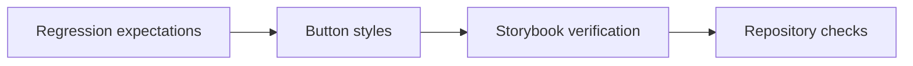

# Button Visual Density Implementation Plan

**Goal:** Apply the approved IconButton density and shared Button radius contract with regression and live visual evidence.

### Task 1: Protect the visual contracts

**Files:**

- Modify: `packages/react/tests/button-density-contract.test.ts`
- Modify: `apps/storybook/src/stories/Button.stories.tsx`

- [x] Cover IconButton surface and icon sizes.
- [x] Cover coarse-pointer hit-area expansion.
- [x] Cover shared 8px radius behavior across Button modes and variants.
- [x] Cover rect, float, and pill boundaries in Storybook Interaction tests.

### Task 2: Implement density and radius alignment

**Files:**

- Modify: `packages/react/src/button/index.module.less`

- [x] Keep IconButton surfaces on the component-wide 24/32/40/48/56px control-height ladder.
- [x] Apply the 16/20/24/28/32px IconButton icon ladder.
- [x] Preserve at least a 44px coarse-pointer target without layout growth.
- [x] Replace the IconButton-only radius branch with one Button float radius.
- [x] Preserve rect and pill shape behavior.

### Task 3: Verify

- [x] Run focused Button style contracts.
- [x] Run `vp check`.
- [x] Run `vp test`.
- [x] Run `vp run storybook#test`.
- [x] Inspect Sizes, Variants, and Shape Support in live Chromium.
- [x] Keep unrelated working-tree changes untouched.

### Task 4: Delivery readiness

- [x] Record the approved design decision and verification evidence.
- [ ] Commit, push, or open a pull request only when explicitly requested.

## Key Files

- [Approved design](../specs/2026-07-22-button-visual-density-design.md#L1)
- [Button styles](../../../packages/react/src/button/index.module.less#L1)
- [Button Storybook coverage](../../../apps/storybook/src/stories/Button.stories.tsx#L1)

---

_Last updated: 2026-07-22 | Reason: document the completed Button density implementation path_
