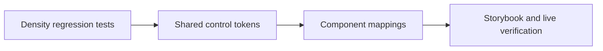

# Component Density Contract Implementation Plan

**Goal:** Apply the approved component-level density contract while preserving 44px coarse-pointer hit targets and leaving Website catalog layout untouched.

### Task 1: Protect the contract

- [x] Update shared token output tests for the 24/32/40/48/56px visible ladder.
- [x] Replace universal visible 44px assertions with fine-pointer size and coarse-pointer target assertions.
- [x] Add public size-prop coverage for `Select` and `Pagination`.

### Task 2: Correct shared control heights

- [x] Update primitive values and generated light/dark CSS output.
- [x] Preserve `--ui-touch-target-min: 44px`.
- [x] Keep Button and input-family behavior on semantic control-height tokens.

### Task 3: Separate visible and touch dimensions

- [x] Update `Select`, `Menu`, `Pagination`, `Tabs`, and `Nav` size mappings.
- [x] Compact `Breadcrumb`, `Checkbox`, `RadioGroup`, `Switch`, and Toast close controls.
- [x] Preserve coarse-pointer targets without changing fine-pointer layout.

### Task 4: Keep public guidance aligned

- [x] Update component and design-system contracts.
- [x] Add or update Storybook size coverage.
- [x] Refresh MCP/LLM metadata only where the public size surface changes.

### Task 5: Verify

- [x] Run focused style and component tests.
- [x] Run `vp check` and `vp test`.
- [x] Run `vp run storybook#test`.
- [x] Verify desktop rendered heights in Storybook's Chromium interaction suite.
- [x] Keep Website catalog layout and unrelated dirty-worktree changes untouched.
- [x] Complete manual Website visual inspection in the running `6108` preview; the locale trigger now consumes the shared `Button size="xs"` contract and renders at 24px instead of 44px.

---

_Last updated: 2026-07-22 | Reason: define the approved component-density implementation path_
