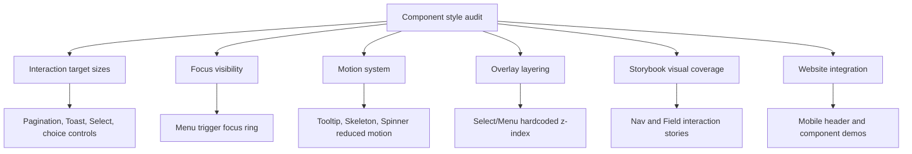

# Component Style Audit Notes

> Date: 2026-05-16
> Scope: `packages/react`, `apps/storybook`
> Reason: Component-library style review before deeper Storybook/website QA.

## Findings To Preserve

### 1. Interaction target size defaults are uneven

Several interactive styles still default to desktop-dense targets:

- `packages/react/src/pagination/index.module.less#L10`: page items and prev/next controls are 32px.
- `packages/react/src/toast/index.module.less#L76`: close button is 24px.
- `packages/react/src/select/index.module.less#L9`: trigger and list items are visually compact by default.
- `packages/react/src/checkbox/index.module.less#L17`, `packages/react/src/radio-group/index.module.less#L31`, `packages/react/src/switch/index.module.less#L22`: visual controls are small and the root does not define a stable minimum hit area.

Decision direction: introduce shared sizing tokens such as `--ui-control-height-*` and `--ui-touch-target-min`, then make compact density opt-in instead of the default for user-facing controls.

### 2. Focus visibility has one explicit regression risk

`packages/react/src/menu/index.module.less#L330` suppresses focus ring on menu triggers globally. This makes keyboard focus less visible before the menu opens.

Decision direction: preserve the trigger focus ring by default. If duplicate feedback is visually noisy when a menu is open, scope the suppression to an open-state selector that still leaves a clear keyboard path.

### 3. Motion tokens are not centralized yet

Component modules independently define durations and easing values (`140ms`, `160ms`, `260ms`, cubic-bezier variants). The rhythm is mostly close, but not governed.

Decision direction: add semantic motion tokens for fast/base/slow durations and standard/exit easing, then migrate floating surfaces and state transitions gradually.

### 4. Reduced-motion coverage is incomplete

Known gaps:

- `packages/react/src/tooltip/index.module.less#L14`: no reduced-motion branch.
- `packages/react/src/skeleton/index.module.less#L23`: shimmer is always animated.
- `packages/react/src/spinner/index.module.less#L14`: spinner is always animated.

Decision direction: reduce transform motion for floating surfaces and provide static or slower alternatives for perpetual loading animations.

### 5. Overlay layer values are partially hardcoded

`NavOverlay` uses `var(--ui-z-dialog)`, but `Select` and `Menu` still carry local `1080`-level values:

- `packages/react/src/select/index.module.less#L78`
- `packages/react/src/menu/index.module.less#L7`

Decision direction: move overlay layering to styles tokens and document the stack order for tooltip/menu/select/popover/dialog/toast/nav overlay.

### 6. Storybook coverage needs style-sensitive interaction cases

`Nav` and `Field` currently lack `play` interaction checks:

- `apps/storybook/src/stories/Nav.stories.tsx#L38`
- `apps/storybook/src/stories/Field.stories.tsx#L12`

Decision direction: add responsive nav overlay interaction checks, long-list scroll checks, and Field label/description/error/required ARIA checks.

### 7. Storybook e2e has timeout risk on heavier stories

`vp run storybook#test` failed on 2026-05-16 with timeout-only failures:

- `Components/Tabs › Basic › smoke-test`
- `Components/Icon › Preview › smoke-test`

Most suites passed, so this looks like test-runner timing or heavy initial render rather than a deterministic assertion failure. Still, it weakens confidence in interaction coverage.

Decision direction: profile those two stories, split heavy catalog work where needed, or raise story-level/test-runner timeout only after confirming the story is actually stable.

### 8. Website mobile header inherits compact icon targets

Website mobile header uses 32px icon actions for navigation, GitHub, and theme toggle. This is visible on the home and components pages and mirrors the component-level `IconButton` density issue.

Decision direction: the website can either opt into larger `IconButton` sizes for header actions or the component library can move default icon targets closer to 40-44px with an explicit compact mode.

### 9. Component gallery demos expose compact defaults in real context

The mobile components page shows several embedded demo controls below touch-friendly size:

- Search input is about 36px high.
- Button/Menu/Dialog/Popover demo buttons appear around 32px high.
- Input demos include 29-32px controls.
- Icon-only Settings demo is 32px.

Decision direction: decide whether component preview cards are intentionally dense documentation UI. If not, gallery examples should render default user-facing density and reserve compact controls for a documented compact preview.

### 10. `NavOverlay` close button can visually compete with long lists

In `components-nav--responsive-long-list` on a 375px mobile viewport, the fixed bottom close button overlaps the same vertical area as lower visible nav items. It is especially noticeable around `Section 12` during the first viewport.

Decision direction: reserve a larger bottom safe area for overlay lists, place the close action in a top fixed affordance, or make the bottom close button part of the overlay layout instead of floating over scroll content.

### 11. Storybook centered layout hides full-page/mobile defects

Storybook's global preview decorator uses `layout: 'centered'` and a padded wrapper. For full-width surfaces such as `Nav.Responsive`, `NavOverlay`, `Toast`, long tables, and mobile layouts, this can make target size and viewport issues harder to see.

Decision direction: add a separate full-viewport story parameter/decorator for responsive and overlay stories, then use that mode for visual QA and interaction tests.

## Next Audit Pass

Run Storybook and website locally, inspect desktop/mobile/reduced-motion-adjacent behavior, and add visual findings here or in a follow-up plan. Priority views:

- Storybook overview for `Button`, `Input`, `Select`, `Menu`, `Tabs`, `Toast`, `Nav`, `Field`, `Pagination`, `MarkdownRender`.
- Website desktop and mobile header/navigation, component cards, documentation reading surfaces, and icon catalog density.

## Footer

Updated on 2026-05-16 to preserve style-level component audit findings before deeper browser QA.
