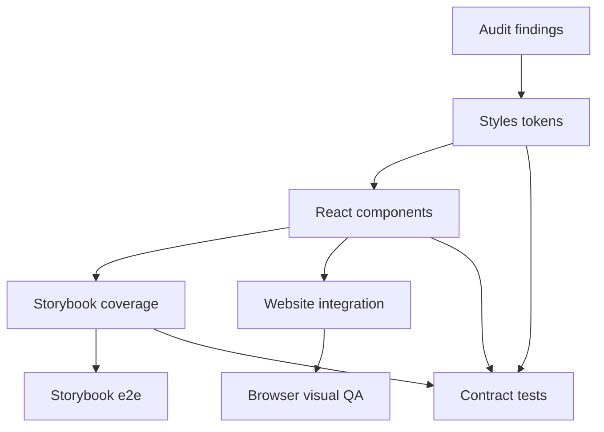

# Component Style System Repair Design

> Date: 2026-05-16
> Scope: `packages/styles`, `packages/react`, `apps/storybook`, `apps/website`
> Source: `docs/superpowers/specs/2026-05-16-component-style-audit-design.md`

## Goal

Repair the component library's style system around touch targets, focus visibility, motion, overlay layering, Storybook coverage, and website integration. The fix should turn the audit into reusable system constraints rather than isolated one-off style tweaks.

## Approach

Use a layered repair:

1. Add small shared style tokens in `@deweyou-design/styles`.
2. Migrate affected components to those tokens.
3. Add Storybook stories/tests that expose responsive and overlay behavior.
4. Update the website to consume the repaired defaults and opt into larger mobile action targets where needed.

This preserves the existing serif-led visual identity and restrained component style. The work should not introduce a new visual language, new dependencies, or broad component API churn.

## Token Design

Add public CSS variables for control sizing, motion, and overlay layering in theme CSS:

- `--ui-control-height-xs: 2rem`
- `--ui-control-height-sm: 2.5rem`
- `--ui-control-height-md: 2.75rem`
- `--ui-control-height-lg: 3rem`
- `--ui-control-height-xl: 3.5rem`
- `--ui-touch-target-min: 2.75rem`
- `--ui-motion-duration-fast: 140ms`
- `--ui-motion-duration-base: 160ms`
- `--ui-motion-duration-slow: 260ms`
- `--ui-motion-ease-standard: cubic-bezier(0.22, 1, 0.36, 1)`
- `--ui-motion-ease-exit: ease`
- `--ui-z-dropdown: 1080`
- `--ui-z-tooltip: 1090`
- `--ui-z-popover: 1100`
- `--ui-z-dialog: 1200`
- `--ui-z-toast: 1300`

`--ui-touch-target-min` is intentionally `44px` equivalent. Component visuals may remain smaller only when the root hit target remains at least that size or when an explicit compact size is used.

Update TypeScript token exports so consumers can reference these tokens from `semanticTokens`. Existing token names remain valid.

## Component Repairs

### Button and IconButton

Button sizing should align to the new control-height tokens:

- `xs`: compact utility size, stays around `2rem`.
- `sm`: user-facing small size, at least `2.5rem`.
- `md`: default size, at least `2.75rem`.
- `lg` and `xl`: keep current visual hierarchy but source their heights from tokens.

`IconButton` inherits Button sizing. Website header actions should use `sm` or `md` instead of relying on a 32px compact affordance.

### Pagination

Pagination page items, ellipsis, and prev/next controls should use `--ui-control-height-sm` as the default minimum block size. The component can keep its compact visual rhythm through padding and typography, but the click target should not remain 32px.

### Select

Select trigger and menu items should use shared control sizing and motion tokens. The popup content z-index should use `--ui-z-dropdown` instead of a hardcoded `1080`.

### Choice Controls

Checkbox, RadioGroup, and Switch roots should define a stable minimum hit area with `min-block-size: var(--ui-touch-target-min)`. The visual control can stay 16-36px as long as the clickable label/root target is reliable. Disabled and focus styles should remain attached to the visible control.

### Toast

Toast close should keep a compact glyph but expose a `44px` hit area. Toast movement should use motion tokens. The close target must not visually bloat the toast; use internal alignment or negative optical spacing if needed.

### Menu

Remove the global trigger focus-ring suppression. Keyboard users should see focus before opening the menu. Menu panel z-index and animations should use shared tokens.

### Tooltip, Skeleton, Spinner

Tooltip should add a reduced-motion branch that removes scale/transform animation. Skeleton should stop shimmer under `prefers-reduced-motion: reduce` and render a static placeholder. Spinner should slow or simplify under reduced motion while keeping loading state perceivable.

### NavOverlay and Nav.Responsive

Long lists need reserved bottom space so the fixed close button does not cover content. The default overlay list should include bottom padding based on close-button height plus safe-area inset. Mobile overlay story should exercise long-list scrolling.

## Storybook Repairs

Add interaction coverage:

- `Nav.Responsive`: mobile trigger opens overlay, overlay links render, choosing an item closes the overlay, active item remains semantic.
- `Field`: label binds to input, description/error drive `aria-describedby`, required marker is visual and required state is announced.

Add full-viewport story coverage:

- `Nav.Responsive`
- `NavOverlay`
- `Toast`
- any responsive story whose correctness depends on the viewport rather than centered content.

Fix Storybook e2e timeouts:

- `Components/Tabs › Basic`
- `Components/Icon › Preview`

The preferred fix is to reduce heavy first-render work or split heavy catalog stories. Raising timeout is acceptable only when direct story inspection confirms rendering is stable and the delay is test infrastructure cost rather than a UI loop.

## Website Repairs

### Mobile Header

Header icon actions on mobile should have at least a `40px` target and preferably match `--ui-touch-target-min`. The visual style should remain quiet: same icon family, no larger decorative frame, and spacing adjusted so the brand title still fits at 375px.

### Components Page Demo Density

Demo controls in component cards should represent user-facing defaults. Buttons, inputs, select triggers, menu/dialog/popover triggers, and icon buttons should avoid 29-32px targets unless the card explicitly documents compact density.

Search input on the components page should use the repaired default control height.

### Nav Overlay Integration

Website mobile nav overlay should inherit the repaired `Nav.Responsive` / `NavOverlay` behavior. The close button should not hide link content, and the overlay should remain usable with long nav lists.

## Testing Strategy

Use test-first implementation for behavioral changes:

- Contract/style tests for new CSS token presence and no hardcoded z-index regression.
- Component tests for affected ARIA and size-related class contracts where practical.
- Storybook interaction tests for `Nav` and `Field`.
- Existing Storybook e2e for all stories.
- Website unit/style tests for navbar and components page density assumptions.

Manual/browser verification should include:

- Storybook at desktop and 375px mobile widths.
- Website home and components pages at desktop and 375px mobile widths.
- Open mobile nav overlay on website and Storybook long-list story.

## Out Of Scope

- Rebranding the visual system.
- Adding a new density prop to every component in this pass.
- Replacing Ark UI primitives.
- Reworking icon registry generation.
- Redesigning website content hierarchy beyond controls affected by the audit.

## Risks

- Increasing default sizes can subtly change website layout. Website mobile header and component cards need visual verification.
- Token migration can miss hardcoded values in less-visible components. Contract tests should catch the highest-risk z-index and motion token regressions.
- Storybook timeout fixes may reveal infrastructure slowness rather than component bugs. Treat timeouts as reliability work, not proof of UI failure.

## Success Criteria

- Default user-facing controls in the audited components meet the intended touch target policy or have explicit compact semantics.
- Keyboard focus remains visible on menu triggers.
- Reduced-motion mode no longer runs transform-heavy or perpetual decorative animation for Tooltip/Skeleton/Spinner.
- Overlay z-index values use shared tokens.
- Storybook e2e passes without `Tabs/Basic` or `Icon/Preview` timeout failures.
- Website mobile header and component demos no longer expose 32px defaults as the primary experience.
- Browser screenshots confirm no horizontal overflow and no NavOverlay close-button/content overlap on 375px mobile.

## Footer

Created on 2026-05-16 after selecting the systemized repair approach for component style audit findings.
