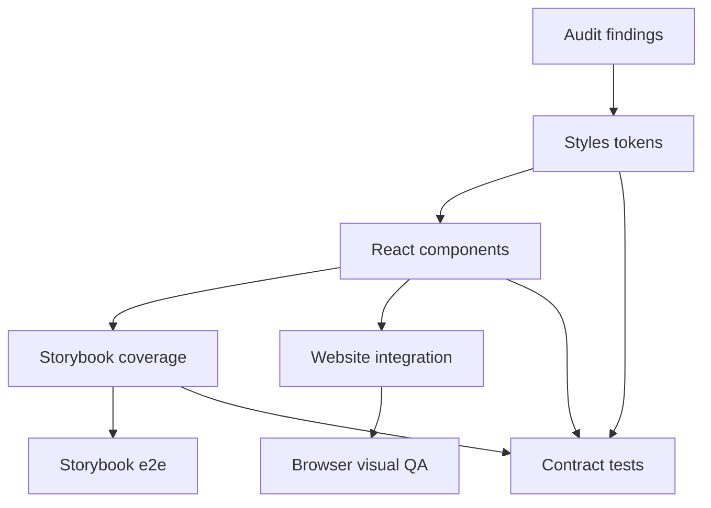

# Component Style System Repair Design

> Date: 2026-05-16
> Scope: `packages/styles`, `packages/react`, `apps/storybook`, `apps/website`
> Source: `docs/superpowers/specs/2026-05-16-component-style-audit-design.md`

## Goal

Repair the component library's style system around touch targets, focus visibility, motion, overlay layering, Storybook coverage, and website integration. The fix should turn the audit into reusable system constraints rather than isolated one-off style tweaks.

## Approach

Use a layered repair:

1. Add small shared style tokens in `@deweyou-design/styles`.
2. Migrate affected components to those tokens.
3. Add Storybook stories/tests that expose responsive and overlay behavior.
4. Update the website to consume the repaired defaults and opt into larger mobile action targets where needed.

This preserves the restrained component style while splitting typography by use case: controls default to Source Han Sans SC, and prose/display content keeps Source Han Serif CN. The work should not introduce a noisy visual language, unrelated dependencies, or broad component API churn.

## Token Design

Add public CSS variables for control sizing, motion, and overlay layering in theme CSS:

- `--ui-control-height-xs: 2rem`
- `--ui-control-height-sm: 2.5rem`
- `--ui-control-height-md: 2.75rem`
- `--ui-control-height-lg: 3rem`
- `--ui-control-height-xl: 3.5rem`
- `--ui-touch-target-min: 2.75rem`
- `--ui-motion-duration-fast: 140ms`
- `--ui-motion-duration-base: 160ms`
- `--ui-motion-duration-slow: 260ms`
- `--ui-motion-ease-standard: cubic-bezier(0.22, 1, 0.36, 1)`
- `--ui-motion-ease-exit: ease`
- `--ui-z-dropdown: 1080`
- `--ui-z-tooltip: 1090`
- `--ui-z-popover: 1100`
- `--ui-z-dialog: 1200`
- `--ui-z-toast: 1300`

`--ui-touch-target-min` is intentionally `44px` equivalent. Component visuals may remain smaller only when the root hit target remains at least that size or when an explicit compact size is used.

Update TypeScript token exports so consumers can reference these tokens from `semanticTokens`. Existing token names remain valid.

Typography tokens should use a shared split-font contract:

- `--ui-font-sans`: Source Han Sans SC stack.
- `--ui-font-serif`: Source Han Serif CN stack.
- `--ui-font-body`: default app text, mapped to sans.
- `--ui-font-control`: buttons, inputs, nav, tooltip, badges, and compact controls, mapped to sans.
- `--ui-font-content`: MarkdownRender, Text body/caption, and long-form prose, mapped to serif.
- `--ui-font-display`: display headings, mapped to serif.

The full-font CSS entry should declare both Source Han Sans SC and Source Han Serif CN. The subset pipeline should be able to target either family so websites can keep explicit font loading without importing full OTF payloads.

`fontSubset` also exposes an explicit production loading policy:

- `inject: true` lets simple Vite SPAs receive `virtual:deweyou-font-subset.css` automatically.
- `fullFonts: false` or unset keeps the app subset-only.
- `fullFonts: 'idle'` injects or exposes an idle loader that registers stable full-font assets after first paint.
- Full-font filenames use the vendored font release version, not a per-build hash, so browser cache can survive repeated app opens until the font version changes.

Responsive behavior must also use one shared standard. Component Less should import `@deweyou-design/styles/less/bridge` and use `@ui-breakpoint-compact: 30rem` for narrow-viewport rules instead of locally inventing `480px`, `500px`, or `520px` cutoffs. Size constraints that do not need a media query can consume the same standard through `--ui-breakpoint-compact`. Prefer capability media queries such as `(pointer: coarse)` and `(hover: none)` when the behavior is about input method rather than viewport width. React components should avoid an internal `isMobile`; expose explicit props or let CSS/container rules adapt the UI.

## Component Repairs

### Button and IconButton

Button sizing should align to the new control-height tokens:

- `xs`: compact utility size, stays around `2rem`.
- `sm`: user-facing small size, at least `2.5rem`.
- `md`: default size, at least `2.75rem`.
- `lg` and `xl`: keep current visual hierarchy but source their heights from tokens.

`IconButton` inherits Button sizing. Website header actions should use `sm` or `md` instead of relying on a 32px compact affordance.

### Pagination

Pagination page items, ellipsis, and prev/next controls should use `--ui-control-height-sm` as the default minimum block size. The component can keep its compact visual rhythm through padding and typography, but the click target should not remain 32px.

### Select

Select trigger and menu items should use `--ui-touch-target-min` by default. The popup content z-index should use `--ui-z-dropdown` instead of a hardcoded `1080`, and long option lists should be scroll-contained with safe-area-aware viewport bounds. Select should expose form `name`/`form` props and Storybook examples should show visible labels.

### Choice Controls

Checkbox, RadioGroup, and Switch roots should define a stable minimum hit area with `min-block-size: var(--ui-touch-target-min)`. The visual control can stay 16-36px as long as the clickable label/root target is reliable. Disabled and focus styles should remain attached to the visible control.

Checkbox and MarkdownRender task-list markers should not maintain separate checkbox glyph styling. Keep the square mark, checked fill, hover state, and hidden read-only state label in one internal `CheckboxMark` component so GFM todos visually align with the Checkbox component while MarkdownRender still renders task markers as static read-only state instead of interactive checkbox controls.

### Toast

Toast close should keep a compact glyph but expose a `44px` hit area. Toast movement should use motion tokens. The close target must not visually bloat the toast; use internal alignment or negative optical spacing if needed.

### Menu

Remove the global trigger focus-ring suppression. Keyboard users should see focus before opening the menu. Menu panel z-index and animations should use shared tokens. Menu items should default to `--ui-touch-target-min`; dense menus must be an explicit opt-in, not the default mobile path. Long menus should have a max block size and `overscroll-behavior: contain`.

### Tooltip, Skeleton, Spinner

Tooltip should add a reduced-motion branch that removes scale/transform animation. Skeleton should stop shimmer under `prefers-reduced-motion: reduce` and render a static placeholder. Spinner and Button loading indicators should stop infinite rotation under reduced motion while keeping loading state perceivable.

### NavOverlay and Nav.Responsive

Long lists need reserved bottom space so the fixed close button does not cover content. The default overlay list should include bottom padding based on close-button height plus safe-area inset. Mobile overlay story should exercise long-list scrolling.

### Focus Visual Treatment

Keyboard focus must remain visible, but the shared mixins should not look like a thick native outline. Use `:focus-visible` plus subtle color-mixed shadow, border color, or background emphasis. Do not use `outline: none` unless the same selector, or a reachable focus selector on that component, provides an equivalent replacement.

Overlay content nodes that can receive Ark-managed focus should have their own quiet `:focus-visible` treatment in addition to trigger/item focus styles.

### Accessibility Semantics Follow-up

The follow-up WIG pass found that RadioGroup, Select, Checkbox, and Switch need explicit accessible-name pathways for label-less composition. Components should accept `aria-label`/`aria-labelledby` where label-less usage is supported; otherwise stories should not demonstrate unnamed controls. Field should preserve both helper text and error text in `aria-describedby` when invalid. ScrollArea viewports that suppress outline need a replacement `:focus-visible` state.

Switch should avoid splitting semantics between a custom clickable visual track and a hidden form control. The hidden/input control remains the semantic switch, while the track is visual.

Tabs menu-trigger semantics are a larger design question: a button with `role="tab"` and `aria-haspopup="menu"` should not be treated as fully resolved until the pattern is redesigned as a true tab trigger plus attached menu or a non-tab menu control.

## Storybook Repairs

Add interaction coverage:

- `Nav.Responsive`: mobile trigger opens overlay, overlay links render, choosing an item closes the overlay, active item remains semantic.
- `Field`: label binds to input, description/error drive `aria-describedby`, required marker is visual and required state is announced.

Add full-viewport story coverage:

- `Nav.Responsive`
- `NavOverlay`
- `Toast`
- any responsive story whose correctness depends on the viewport rather than centered content.

Fix Storybook e2e timeouts:

- `Components/Tabs › Basic`
- `Components/Icon › Preview`

The preferred fix is to reduce heavy first-render work or split heavy catalog stories. Raising timeout is acceptable only when direct story inspection confirms rendering is stable and the delay is test infrastructure cost rather than a UI loop.

## Website Repairs

### Mobile Header

Header icon actions on mobile should have at least a `40px` target and preferably match `--ui-touch-target-min`. The visual style should remain quiet: same icon family, no larger decorative frame, and spacing adjusted so the brand title still fits at 375px.

### Components Page Demo Density

Demo controls in component cards should represent user-facing defaults. Buttons, inputs, select triggers, menu/dialog/popover triggers, and icon buttons should avoid 29-32px targets unless the card explicitly documents compact density.

Search input on the components page should use the repaired default control height.

Search and preview placeholders should use `…` rather than ASCII `...`, and form-like catalog controls should keep visible labels or explicit accessible names.

Storybook examples must not hardcode desktop-only widths such as `480px` or `420px`. Use `width: min(30rem, 100%)`, wrapping control rows, or the shared component responsive behavior so a 375px viewport does not create horizontal overflow.

### Nav Overlay Integration

Website mobile nav overlay should inherit the repaired `Nav.Responsive` / `NavOverlay` behavior. The close button should not hide link content, and the overlay should remain usable with long nav lists.

## Testing Strategy

Use test-first implementation for behavioral changes:

- Contract/style tests for new CSS token presence and no hardcoded z-index regression.
- Component tests for affected ARIA and size-related class contracts where practical.
- Storybook interaction tests for `Nav` and `Field`.
- Existing Storybook e2e for all stories.
- Website unit/style tests for navbar and components page density assumptions.

Manual/browser verification should include:

- Storybook at desktop and 375px mobile widths.
- Website home and components pages at desktop and 375px mobile widths.
- Open mobile nav overlay on website and Storybook long-list story.
- Static scan for rogue responsive cutoffs in governed source: component Less should reference `@ui-breakpoint-compact` or `--ui-breakpoint-compact`, and stories should use `min(30rem, 100%)` or container-relative sizing instead of one-off pixel breakpoints.

## Out Of Scope

- Rebranding the visual system.
- Adding a new density prop to every component in this pass.
- Replacing Ark UI primitives.
- Reworking icon registry generation.
- Redesigning website content hierarchy beyond controls affected by the audit.
- Fully redesigning the Tabs menu-trigger semantic model; record it as follow-up if it cannot be fixed without a broader API decision.

## Risks

- Increasing default sizes can subtly change website layout. Website mobile header and component cards need visual verification.
- Token migration can miss hardcoded values in less-visible components. Contract tests should catch the highest-risk z-index and motion token regressions.
- Storybook timeout fixes may reveal infrastructure slowness rather than component bugs. Treat timeouts as reliability work, not proof of UI failure.

## Success Criteria

- Default user-facing controls in the audited components meet the intended touch target policy or have explicit compact semantics.
- Keyboard focus remains visible on menu triggers.
- Reduced-motion mode no longer runs transform-heavy or perpetual decorative animation for Tooltip/Skeleton/Spinner.
- Overlay z-index values use shared tokens.
- Storybook e2e passes without `Tabs/Basic` or `Icon/Preview` timeout failures.
- Website mobile header and component demos no longer expose 32px defaults as the primary experience.
- Browser screenshots confirm no horizontal overflow and no NavOverlay close-button/content overlap on 375px mobile.
- No component introduces a private mobile breakpoint; narrow viewport behavior uses the shared `@ui-breakpoint-compact` / `--ui-breakpoint-compact` standard or capability queries.

## Footer

Created on 2026-05-16 after selecting the systemized repair approach for component style audit findings.
