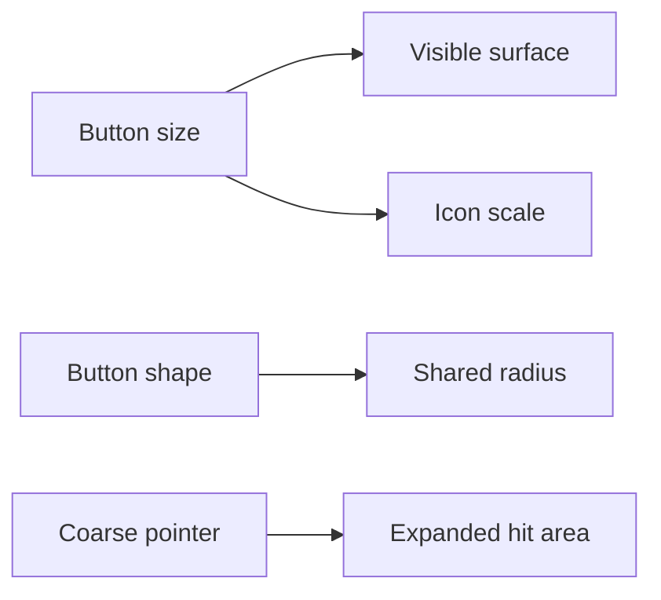

# Button Visual Density Design

> Date: 2026-07-22
> Status: Approved through live Storybook review with the user

## Goal

Make Button and IconButton density feel deliberate across all five sizes while keeping shape semantics consistent and preserving accessible touch targets.

## Size Contract

IconButton visual surfaces continue to follow the Button control-height ladder:

| Size | Surface | Icon |
| ---- | ------: | ---: |
| `xs` |    24px | 16px |
| `sm` |    32px | 20px |
| `md` |    40px | 24px |
| `lg` |    48px | 28px |
| `xl` |    56px | 32px |

- IconButton has no internal padding; the surface and icon variables define its optical spacing.
- On coarse pointers, the interactive area expands to at least 44px without changing the visible surface or document layout.
- Text Button icon sizing remains unchanged.
- This ladder supersedes the earlier 32/40/44 compact values after the component-wide density audit exposed the same inflation across multiple controls.

## Shape Contract

Shape is orthogonal to variant, mode, and size:

- `rect`: 0
- `auto` and `float`: 8px
- `pill`: 999px

Filled, outlined, ghost, and IconButton modes share the same 8px Button float radius. Link retains the same internal radius value even though it has no boxed visual treatment. The Button implementation derives 8px from the existing float token instead of changing the global radius tokens or adding a new global tier.

## Acceptance Criteria

- Adjacent IconButton sizes have visibly distinct surfaces and icons.
- `md` and `lg` do not reuse the same icon size.
- Filled, outlined, ghost, and IconButton float corners resolve to 8px.
- Explicit rect and pill shapes remain 0 and 999px.
- Coarse-pointer hit areas remain at least 44px.
- Focus, hover, active, disabled, and loading behavior remain unchanged.
- Focused tests, repository checks, Storybook Interaction tests, and live Chromium inspection pass.

## Non-goals

- Changing global radius tokens
- Changing public Button props
- Changing text Button typography or spacing
- Redesigning other components

## Key Files

- [Button styles](../../../packages/react/src/button/index.module.less#L1)
- [Button density contracts](../../../packages/react/tests/button-density-contract.test.ts#L1)
- [Button Storybook coverage](../../../apps/storybook/src/stories/Button.stories.tsx#L1)
- [React component contracts](../../design/components.md#L53)

---

_Last updated: 2026-07-22 | Reason: record the approved Button density and radius contract_
