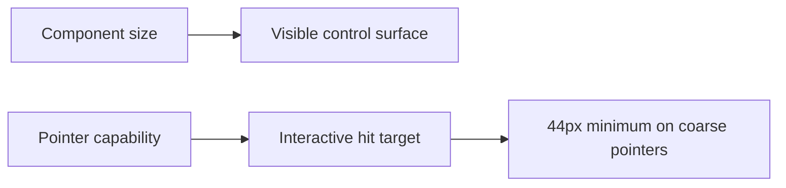

# Component Density Contract

> Date: 2026-07-22
> Status: Approved through live Website audit and explicit user confirmation

## Goal

Restore deliberate desktop density across the component library without weakening touch accessibility.

## Size Contract

Visible component surfaces use the documented five-step control-height ladder:

| Size | Visible height | Typical use                                       |
| ---- | -------------: | ------------------------------------------------- |
| `xs` |           24px | inline utilities and compact table actions        |
| `sm` |           32px | toolbars, menus, sidebars, and secondary controls |
| `md` |           40px | default controls                                  |
| `lg` |           48px | prominent actions and key forms                   |
| `xl` |           56px | intentionally large calls to action               |

`--ui-touch-target-min` remains 44px, but it is an input-capability contract rather than a universal visible height. Fine-pointer layouts use the component size. Coarse-pointer layouts expand the hit target to at least 44px, preferably without growing the visible surface or document layout when the element supports a safe pseudo-element hit area.

## Component Rules

- `Button`, `Input`, and `NumberInput` consume the corrected global control-height ladder.
- `Select` and `Pagination` expose `sm`, `md`, and `lg` sizes, defaulting to `md`.
- `Menu`, `Nav`, and `Tabs` preserve their existing `sm`, `md`, and `lg` APIs and map them to 32px, 40px, and 48px visible heights.
- `Breadcrumb`, `Checkbox`, `RadioGroup`, and `Switch` use the 32px compact desktop rhythm while retaining 44px coarse-pointer targets.
- `Toast` close controls use a compact visible surface and retain a 44px coarse-pointer target.
- Hover, selected, disabled, focus-visible, reduced-motion, keyboard, and Ark UI behavior remain unchanged.

## Non-goals

- Changing Website catalog cards, preview minimum heights, hero spacing, or grid layout
- Compressing content surfaces such as Editor, Textarea, Dialog, Markdown, or masonry content
- Adding a global `density` provider or changing component radii, colors, or typography roles
- Reducing the 44px coarse-pointer minimum

## Acceptance Criteria

- The semantic control-height tokens resolve to 24/32/40/48/56px.
- Fine-pointer `sm` menu rows and compact controls no longer render at 44px.
- Default form controls render at 40px unless a component explicitly selects another size.
- Coarse-pointer targets remain at least 44px.
- Existing interaction and accessibility behavior remains intact.
- Focused tests, `vp check`, `vp test`, Storybook Interaction tests, and live Website/Storybook inspection pass.

---

_Last updated: 2026-07-22 | Reason: record the approved component-level density and touch-target boundary_
