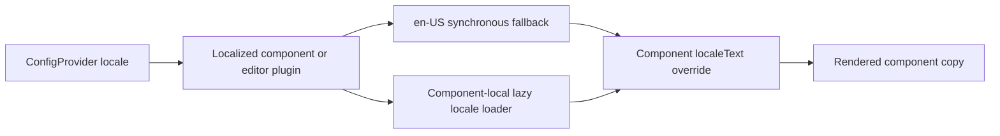

# Config Provider Localization Design

> Date: 2026-07-22
> Status: Approved through user-confirmed requirement alignment



## Goal

Add a shared `ConfigProvider` to `@deweyou-design/react` and use it as the global entry point for component-library configuration. The first supported setting is locale. Components with built-in copy should own their translations, load non-default translations only when needed, and keep component-specific copy overrides local to that component.

## Supported Locales

- `en-US` — synchronous default and fallback
- `zh-CN` — lazy-loaded Simplified Chinese
- `zh-TW` — lazy-loaded Traditional Chinese
- `ja-JP` — lazy-loaded Japanese
- `ko-KR` — lazy-loaded Korean

The provider does not inspect browser globals. An absent provider or absent `locale` prop resolves deterministically to `en-US`.

## Public API

```tsx
import { Suspense } from 'react';
import { ConfigProvider } from '@deweyou-design/react';

<Suspense fallback={<AppSkeleton />}>
  <ConfigProvider locale="zh-CN">
    <App />
  </ConfigProvider>
</Suspense>;
```

`ConfigProvider` owns only global configuration values. It does not expose a global `localeText` escape hatch. Future global settings may be added as explicit, typed provider props when a real shared requirement exists.

Components that render built-in copy expose a component-owned, typed `localeText` prop:

```tsx
<Pagination localeText={{ previous: 'Previous step' }} />
```

Component `localeText` values override the resolved built-in locale. Existing explicit label props remain supported and take precedence over `localeText` when both address the same element.

## Translation Ownership

Translations live with the component that consumes them:

```text
packages/react/src/pagination/
├── locale/
│   ├── en-us.ts
│   ├── zh-cn.ts
│   ├── zh-tw.ts
│   ├── ja-jp.ts
│   ├── ko-kr.ts
│   └── loader.ts
├── index.test.tsx
└── index.tsx
```

- There is no repository-wide object containing every component's copy.
- Each locale module satisfies the component's locale-text type.
- Editor plugin copy belongs to the public plugin that renders it, not to one editor-wide dictionary unless the copy is rendered by the editor surface itself.
- Consumer content such as children, field labels, validation messages, image captions, and authored markdown is never translated by the component library.

## Loading Behavior

- A used component synchronously includes only its `en-US` locale text.
- The other four locale modules are dynamic imports split by component and locale.
- Unused components do not contribute locale loaders or locale chunks to a subpath-based consumer bundle.
- Loaded locale promises and resolved dictionaries are cached at module scope.
- On a runtime locale change, already revealed content remains visible until the requested locale dictionary resolves, then updates atomically.
- On the first uncached non-English render, the component suspends to the nearest consumer-owned Suspense boundary.
- `ConfigProvider` does not own application loading UI or insert a root Suspense fallback.
- A complete component-level `localeText` override may be used by consumers that need a synchronous copy source for a specialized rendering path, while partial overrides still inherit the resolved built-in locale.

This contract preserves the existing synchronous default experience while keeping non-English copy out of the initial component chunk.

## Formatting

The provider locale also supplies the default BCP 47 locale to components that perform locale-aware formatting. A component-specific formatting prop, such as `NumberInput.locale`, takes precedence over the provider locale.

Translation and formatting remain separate concerns: locale text controls built-in copy, while platform `Intl` options continue to control numeric or future date formatting.

## Initial Migration Scope

Migrate all existing built-in visible and accessibility copy in public React components and editor plugins, including the current copy in:

- navigation, pagination, dialog, toast, and tabs
- number input and image preview/masonry surfaces
- code, markdown, and Mermaid renderers
- virtualized list and masonry accessibility labels
- editor code, link, and table plugin controls

Keep caller-authored copy and example-only Storybook/website prose outside the translation dictionaries.

## Delivery Surface

The public behavior change updates:

- package root and `./config-provider` exports
- component props and subpath entrypoints affected by locale text
- colocated unit tests plus package/export/tree-shaking contracts
- Storybook interaction coverage plus a global locale toolbar backed by the preview-root `ConfigProvider`
- website component catalog, localization guidance, and a shell-level locale selector backed by the application-root `ConfigProvider`
- `README.md`, `README_ZH.md`, and `docs/design/components.md`
- MCP component metadata and regenerated `apps/website/public/llms.txt`
- the repository-owned component skill when its workflow or checklist changes

## Acceptance Criteria

- The five approved locale codes are type-safe and documented.
- Missing provider configuration renders the existing English defaults synchronously.
- Non-English component dictionaries load through component-local dynamic imports.
- A locale switch does not replace already revealed component content with a loading fallback.
- Component `localeText` overrides apply only to that component.
- Nested providers override locale for their subtree.
- Storybook and website global locale controls update descendant component copy without translating caller-authored story or website prose.
- Number formatting inherits provider locale unless the component prop overrides it.
- A bundle contract proves an unused component's locale marker is absent and non-English locale text is emitted outside the synchronous component entry.
- Repository checks, tests, Storybook e2e, and the recursive build pass.

## Deferred

- automatic browser-locale detection
- right-to-left direction management
- global translation overrides on `ConfigProvider`
- application content translation
- third-party i18n framework adapters
- languages other than the five approved locales

_Last updated: 2026-07-22 | Reason: record the ConfigProvider localization architecture, global preview controls, and delivery contract_
